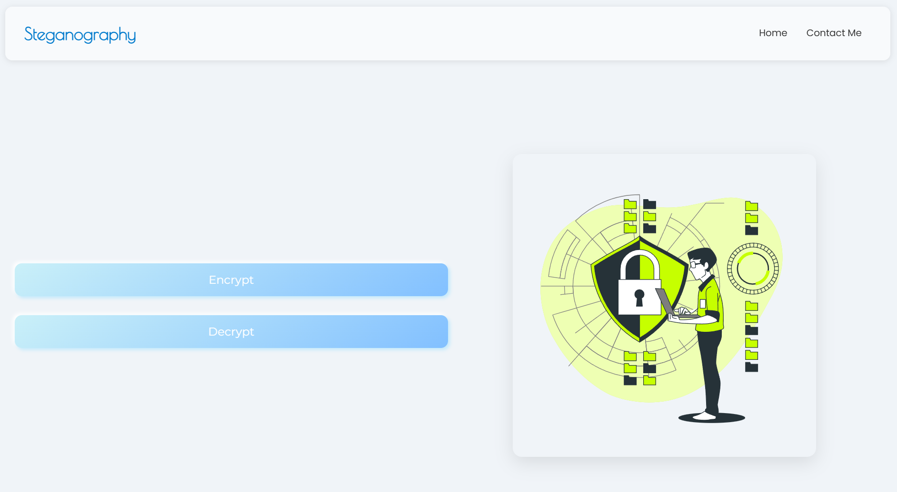
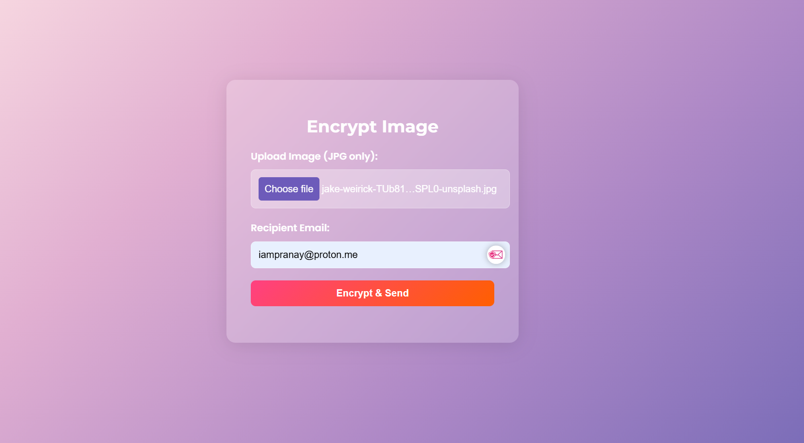

# Image Encryption and Decryption Tool

This is a simple web application for encrypting and decrypting images using the `imcrypt` command-line utility.

## Demo





## Technologies Used

- Node.js
- Express.js
- Multer
- imcrypt (command-line utility)

## Features

- Encrypt images with a secret key.
- Decrypt encrypted images using the corresponding key.

## Getting Started

### Prerequisites

- Node.js installed on your machine.
- `imcrypt` command-line utility installed. [Installation guide]([https://example.com/imcrypt-installation](https://www.npmjs.com/package/imcrypt))

### Installation

1. Clone this repository:

   ```bash
   git clone https://github.com/yourusername/image-encryption-tool.git
   ```

2. Install dependencies:

   ```bash
   npm install
   ```

### Usage

1. Run the server:

   ```bash
   node index.js
   ```

2. Open your web browser and navigate to `http://localhost:3000`.

3. Navigate to `/encrypt` for encrypting an image.
   
4. Navigate to `/decrypt` for decrypting an image.

### Encryption

- Provide the image file to encrypt.
- The application will generate an encrypted image and a key file.

### Decryption

- Provide the encrypted image and the corresponding key file.
- The application will decrypt the image.

## Contributing

Contributions are welcome! Please feel free to open an issue or submit a pull request for any bugs fixes, feature requests, or improvements.

## License

This project is licensed under the MIT License - see the [LICENSE](LICENSE) file for details.

---

**Note**: Nodemailer is currently not implemented in this version. It will be added in a future update. If you need assistance or have any questions, feel free to create an issue. Contributions are welcomed!

--- 

